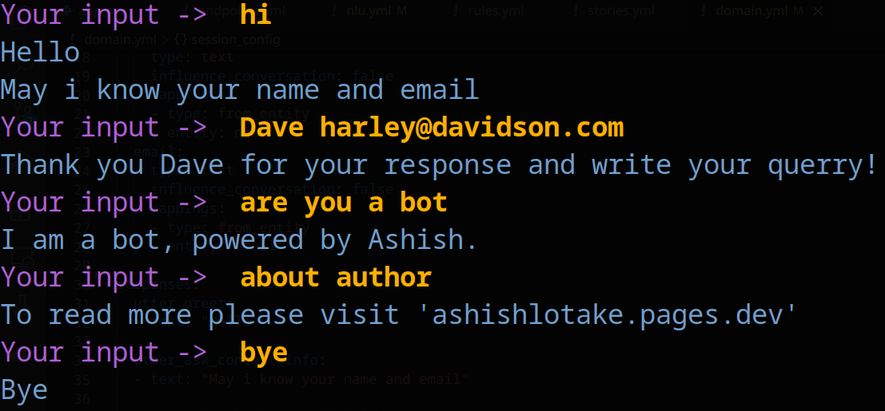

# General Q&A ChatBot

## First lets breifly understand what are chatbot and type of chatbot
1. Conversational AI, which can talk to you like there is a human on the other side. But this type of bot have some limitation
    1. It has to construct all the words from the root up, and then form a sentence which is grammatically correct.
    2. Its slow. YES! It has to perform all the process in live time. So this is not the type of bot you want your company to use.
    3. It requires lots of training data
2. Rule Based ChatBot
    1. In which you define rule what to say when user say something
        1. eg: when user says **hi** ,bot will replay with **welcome**
    2. Its faster than the pervious approach
3. RASA, does both !
    1. Fast, cause we can define rule for simple dialogue
    2. Can learn from training data, to give specific reply 


## Follow this to get started 
1. Create a virtual environment for python
    ```
    $ python3 -m venv /venv/rasa_venv
    ```
3. Then 
    ```
    $ git clone https://github.com/ashishlotake/rasa_chat_bot.git
    ```
3. Then install RASA and Flask
    ```
    $ pip3 install rasa && pip3 install flask && pip3 install requests
    ```

4. To run my bot
    ```
    $ rasa shell
    ```
    *this will create a bot template in your current directory*

>This method is for Linux/UNIX system

5. To create your own bot
    ```
    $ rasa init
    ```

## Lets understand file
1. Intents, Entities, Slots and Responses
    - Intents --> its like what the user is implying
        - eg ->     Good Morning! *or* Hi! *or* Hey! *or* Hello.
        then we can group this one category say `greet`
    - Entities --> piece of information that can be extracted from user message
        - eg -> user -> my `name` is ashish and my `mail` is ashish@gmail.com *name and the email these can be extracted as `entities`*
    - Slots -> Now that we have extracted a piece from user message, now need to store it into a variable (`slot`) so we can use this in further conversation .
    - Responses -> As we have read about rule based chatbot, define what bot will say when the user says something.
        - user -> hi
        - bot -> Welcome, may i know your name
2. nlu.yml
    - This house all the NLU training data, for model training
3. rules.yml
    - This are rules, when user says specific thing the bot give defined response
    - eg-> when user says **hi** ,bot whill replay with **welcome**
4. stories.yml
    - This is like flow of conversation 
    - So the bot gets an idea of conversation flow 
5. domain.yml
    - this house all the info of the intent, bot response, slots, entities

## Lets see 

1. domain.yml 
    ```
    intents:
        greet
        goodbye

    entities:
        name
        email
    
    responses:
        utter_greet:
        - text: "Welcome!, I am happy to help you in this journey. May i know your name and email"

        utter_acknowledge_provided_info:
        - text: "Thank {name} for your response"
        
        utter_goodbye:
        - text: "GoodBye"
    ```
2. stories.yml
    ```
    stories:

    - story: story_name
        steps:
        - intent: greet
        - action: utter_greet
            entities:
            - name
            - email
        - action: utter_acknowledge_provided_info
    ```

3. rules.yml
    ```
    rules:

    - rule: Say goodbye anytime the user says goodbye
        steps:
        - intent: goodbye
        - action: utter_goodbye
    ```
4. nul.yml
    ```
    nlu:
    - intent: greet
    examples: |
        - hi
        - welcome
        - good morning
        - good evening
        - hello
    - intent: goodbye
    examples: |
        - bye
        - goodbye
    ```


## lets see a sample chat to make the understand concrete

```
user: hello
```
`bot classify this a greet intent and then make the suitable response`
```
bot: Welcome!, I am happy to help you in this journey. May I know your name and email
```
`bot extract the name and email entity from user message and save then in name and email slots`
```
user: My name is ashish and mail is ashish@gmail.com
```
`then bot acknowledges the user for his response`
```
bot: Thanks ashish for you response
```


I can explain, and tell what I have done, but I can't do a better job than the [RASA DOCS](https://rasa.com/docs/rasa/), so please refer this for further explanation.

## After creating the training data train the model

```
$ rasa train --fixed-model-name chat_bot
```
- This will train the bot and save the trained model with name `chat_bot` and in the `/model` directory
- Now that we have trained model, run the chatbot in terminal
```
$ rasa shell
```

- /stop --> to exit from the conversation
- /restart --> the restart the conversation without exiting rasa shell 

## Conclusion
Rasa is great open source tool to build chat-bot fast and easy. We can also implement advance machine learning model our our own, instead of using the default one.
There's lot more in Rasa, all we done is scratch the surface, like actions, forms, rules, regex, synonyms, interactive learning, config files, pipelines, and so much more. But the thing covered till far will be more than enough to get to started.

