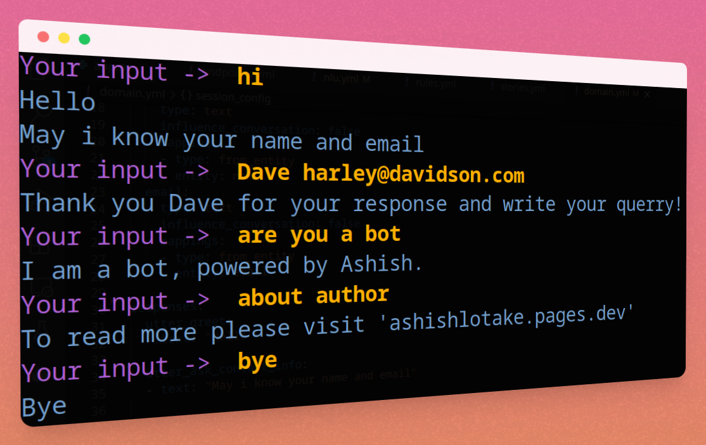
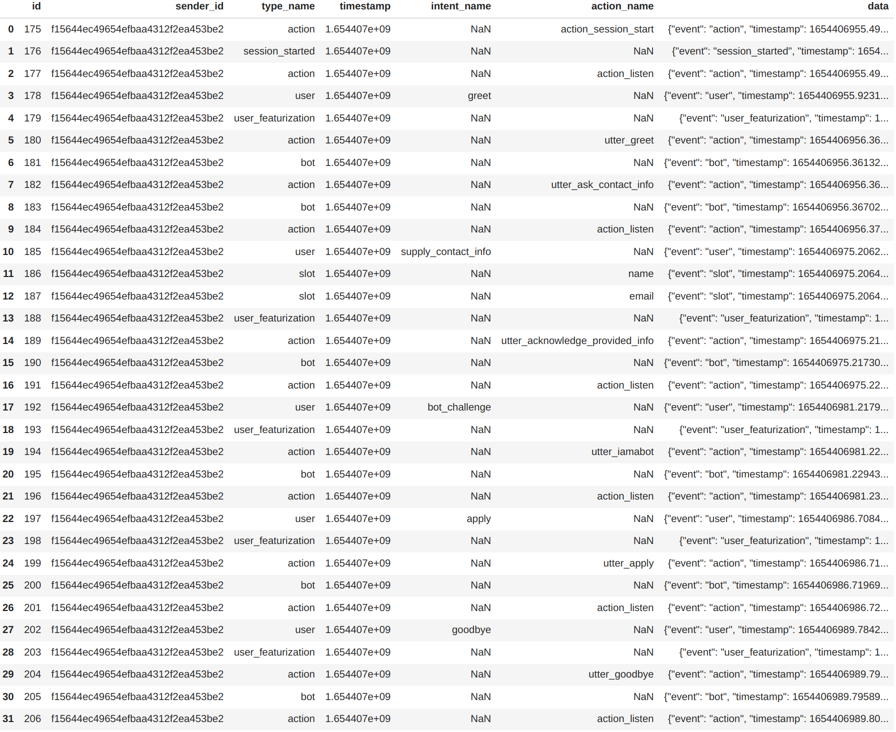
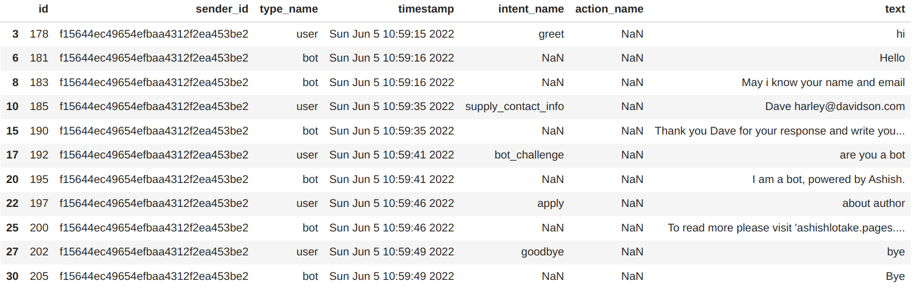

# General Q&A ChatBot

[](https://ashishlotake.pages.dev/)

##  Let's broadly classify different types of chatbots:

1. **Full Fledge Conversational ChatBot**:- this is a slow chatbot that generates text and gives grammatically correct sentences. The idea is excellent, but this is not what we want in production, because we want to solve user queries asap. And it required lots of training data. (which is difficult to get)
2. **Rule-based ChatBot**:- This is a simple yet super fast chatbot, in this, we define a set of rules for a bot to reply based on user response. But it's kind of dumb chatbot if it encounters something out of a defined parameter. It may crash or won't reply.
3. **Conversational ChatBot + Rule-based ChatBot = RASA** :- Rasa can do both. It's fast because we can define rules for simple dialogue. Can learn from training data, to give a specific reply. This is what we want so our customers can have their queries resolved asap, without human intervention.

##  Let's get 
- Create a virtual environment for python and activate 
- Install 
- rasa init *(this will create a layout for creating your bot)*
```
$ python3 -m venv /venv/rasa_venv
$ source /venv/rasa_venv/bin/activate
$ pip3 install rasa 
$ rasa init
``` 
##  Let's briefly understand the input of 

- Intents → is like what the user is 
- Entities → pieces of information that can be extracted from the user 
- Slots → Now that we have extracted a piece from the user message, now need to store it into a variable (`slot`) so we can use this in further 
- Responses → As we have read about the rule-based chatbots, define what the bot will say when the user says something. This is similar, we define bots' responses.
## Let's briefly understand each file 
- *nlu.yml* - this houses all the NLU training data, for model training.
```
nlu:
 - intent: greet
 examples: |
    - hi
    - welcome
    - good morning 
    - good evening 
    - hello 
 - intent: goodbye
 examples: | 
    - bye 
    - goodbye
```
- *rules.yml* - these are rules, which we specific, like what bot will be when the user says goodbye
```
rules:
 - rule: Say goodbye anytime the user says goodbye
     steps:
     - intent: goodbye
     - action: utter_goodbye
```
- *domain.yml* - this house all the info of the intent, bot response, slots, and entities.
```
intents:
   greet
   goodbye
entities:
   name
   email
responses:
   utter_greet:
   - text: “Hello”
   utter_acknowledge_provided_info:
   - text: “Thank you {name} for your response and write your querry!”
   utter_goodbye:
   - text: “Goodbye"
```
- *stories.yml* - this is like the flow of conversation, so the bot can learn the flow of conversation.
```
stories:
  - story: greet_user
  steps:
  - intent: greet
  - action: utter_greet
     entities:
     - name
     - email
  - action: utter_acknowledge_provided_info
```
##  Let's see the bot in action


###  Let's understand what's happening under the hood 
 
```
user -> hi
```
*hereafter user replay bot, classify this as "greet" intent and then ask for info*
```
bot -> Hello !May I know your name and email? 
user -> Dave harley@davidson.com
```
*hereafter the user gave his name and the email bot acknowledges the user and asks the user for his/her query*
```
bot -> Thank Dave you for your response write your query!
user -> are you a bot
```
*user asks for "bot/human check", then the bot gives an appropriate response*
```
bot -> I am a bot, powered by Ashish
user -> about author
```
*user asks about the author, it gives the author's [website](https://ashishlotake.pages.dev/)*
```
bot -> To read more please visit ashishlotake.pages.dev
user -> Bye
bot -> Bye
```
*We have defined a rule when the user says "Bye", the bot replies*
- ***/stop*** - *To stop/end the*
- ***/restart*** - *restart the conversation without leaving the rasa shell.*
##  Now I guess you want to keep your customer chat saved! 
We will be using opensource Postgres SQL to save our chat records 
- just add the following code at the end of your endpoint.yml
```
tracker_store
    type: SQL
    dialect: "postgresql"  # the dialect used to interact with the db
    url: localhost #(optional) host of the sql db, e.g. "localhost"
    db: "rasa"  # path to your db
    username: ""  # username used for authentication
    password: ""  # password used for authentication
    query: # optional dictionary to be added as a query string to the connection URL
    driver: my-driver:
```
*In the above code just replaces your **username** and **password** for your database user, and if your database is **hosted on another server**, then please do **change** the **URL** also.*
##  Data PreProcessing 
*The data that is stored in the database is unfiltered, so we need to perform some data pre-processing to make it more readable.*


```
df = pd.read_csv("./events.csv") ## reading the csv file

df["data"] = df.data.apply(lambda x: json.loads(x)) ## string to dict

df["timestamp"]= df["timestamp"].apply(lambda x : datetime.fromtimestamp(x).ctime()) ## timestamp to datetime


def retrive_txt(c):
    '''
    extract the message in "text" key from the dict
    and for the rest just return NaN 
    '''
    try:
        return c["text"]
    except:
        return "NaN"


df["text"]= df["data"].apply(retrive_txt)

final_df = df[df["text"] != "NaN"]

final_df = final_df.loc[:, final_df.columns != "data"]

final_df
```


## Conclusion

 Rasa is a great open-source tool to build chatbots fast and easy. We can also implement advanced machine learning models on our own, instead of using the default one.

There’s a lot more in Rasa, all we have done is scratch the surface, like actions, forms, rules, regex, synonyms, interactive learning, config files, pipelines, and so much more. But the thing covered till far will be more than enough to get started.

